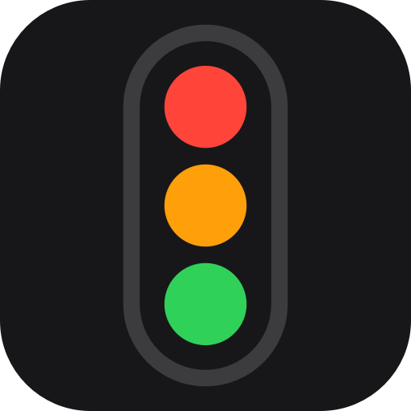

# Traffic Light

An ambient status tool for Claude Code. It answers one question without you reading a terminal: **does any of my sessions need me right now?**

Colour, bell, and phone push are three renderings of the same answer. The point is to leave the desk and be pulled back only when a session genuinely needs a human.

> Clicking a row activates Claude.app; jumping to a *specific* session is not possible — see below.

**[Release notes](RELEASES.md)** — what changed in each version.

## Quick start

```bash
npx agent-traffic-light install
```

It shows you exactly what it will write and waits for you to say yes. Nothing
is touched before that — `--dry-run` prints the same plan and stops, and
`--yes` skips the question for CI and reinstalls.

Saying yes builds **Traffic Light.app** into `~/Applications`, starts it, keeps
it running at login, and installs the hooks as a Claude Code plugin. The hooks
themselves are never merged into your `settings.json`: two lines are added to
it naming the plugin, and removing those two lines is most of the uninstall.
Needs the Swift toolchain, which ships with Xcode Command Line Tools
(`xcode-select --install`), not full Xcode.

The app is compiled on your machine, so it carries no quarantine attribute and
Gatekeeper never inspects it — which is how it can be a real app with an icon
and still need no signing certificate, no notarization and no `$99/yr`.

Hooks go in for every project, since one light for every session is the
point. Add `--local` to limit them to the current directory.

From a clone instead:

```bash
git clone https://github.com/supunTE/traffic-light.git
cd traffic-light && sh install.sh
```

And the way out, which is worth reading before the way in:

```bash
npx agent-traffic-light uninstall
```

It lists what it will remove and what it will leave — with the size of each
file it is leaving — and waits for a yes, the same as installing. Your settings
and state stay unless you add `--purge`. Two directories belong to Claude Code
rather than to Traffic Light, so it names them and leaves them alone.

Or add the hooks the way you add any other plugin, from inside Claude Code:

```
/plugin marketplace add supunTE/traffic-light
```

```
/plugin install traffic-light@traffic-light
```

That is the hooks and nothing else. The daemon is a compiled binary, so run
`npx agent-traffic-light install` afterwards or the hooks report into an inbox
nothing is reading. Doing it in that order is fine: the installer re-registers
the marketplace from a local copy, so the hooks keep working with no network
and no clone.

**Hooks load when a session starts.** Open a new session — or restart Claude — then check:

```bash
traffic-light doctor
```

```
  ✓ daemon            state 2s old
  ✓ claude sessions   2 live
  ✓ hooks             all 2 sessions reporting
  ! push              disabled
  …
```

`doctor` prints seven rows — eight once push is on and reaching a server, nine if the ingest filter has refused anything; four are shown here. It knows every way this can be half-installed and prints the command that fixes each one. **[docs/SETUP.md](docs/SETUP.md)** has the full walkthrough, phone push, configuration, and troubleshooting.

```bash
traffic-light status              # every live session and its Signal
traffic-light broken "<reason>"   # Distress Call — Claude runs this when stuck
```

`broken` is the one signal Claude has to volunteer: every other state is read
from hooks, but a session going round in circles looks exactly like one making
progress. **Claude will not use it unless you tell it the command exists** —
the installer offers to add that instruction to `~/.claude/CLAUDE.md`, or you
can write your own.

Everything else is in **Settings…**, from the menu bar. Quit from there too — it stays
quit until you next log in, rather than being relaunched a second later.

## The five Signals

A **Signal** is the state of exactly one **Session** (one Claude Code conversation in one working directory — several run at once across worktrees).

| Signal | Looks like | Meaning | Not to be confused with |
|---|---|---|---|
| **Working** | turning purple arc | Claude is making progress on its own. *Leave it alone.* | running, busy, active |
| **Asking** | amber **?** | Blocked on you — permission prompt, `AskUserQuestion`, idle-needing-input, or a turn that ended on a question. Nothing advances until you answer. | waiting, blocked |
| **Done** | green **✓** | The turn ended, nothing was asked of you, and the work is ready to read. | finished, ready, idle |
| **Broken** | red **⚠** | Crashed, stalled for half an hour, or made a Distress Call. *Go rescue it.* | error, failed |
| **Idle** | thin white ring | Nothing is claiming your attention — just opened, gone quiet, or not reporting. | off, empty, done |

Red, amber and green mean what they mean at a junction — stop, wait, go — which is the whole reason for the name. Purple sits outside that sequence on purpose: a junction has no lamp for *making progress*.

Shape carries the meaning as well as colour: the dot is 14pt on a background you chose, and roughly one man in twelve cannot separate red from green — so the Signals that mean *act now* differ in silhouette, not only hue. **Working is the only one that moves.** Motion is the loudest thing an ambient widget can do, so exactly one state gets it.

**Settings → Chimes** gives a picker and a play button per Signal; `traffic-light preview` auditions all fourteen.

`Done` and `Asking` are deliberately separate: `Asking` owes an answer, `Done` does not. Read the amber as *it stopped on you* and the green as *it stopped, and you can look when you like*. `Done` and `Idle` are separate because `Done` means a turn produced something to read, and `Idle` means nothing is claiming you at all.

The **Aggregate Signal** — what a whole-screen renderer shows — is the highest-priority Signal across all live Sessions:

```
Broken > Asking > Done > Working > Idle
```

Two more terms worth knowing: a **Transition** is a change from one Signal to another — **bells ring on Transitions, never on Signals**, so a Session sitting in `Asking` rings once rather than continuously. A **Renderer** is anything that turns a Signal into something a human perceives (dot, bell, push); Renderers are interchangeable and adding one changes no hook.

## What a row says

Every Renderer shows the same line: a Signal, a Session, how long since it last did anything, and a note in English. That age is what separates a session working away from one that stopped saying anything half an hour ago — the Signal can be the same for both. The note is named for *your* problem, not for the inference behind it — "Needs permission" rather than "unanswered tool call".

```
  ● Asking   api-server                      62s  Needs permission · Running a command · 1 min
  ● Asking   web-client                       8s  Waiting for your answer
  ● Broken   api-worktree-a1b2c3           1860s  Stuck for 31 min
  ● Working  traffic-light                    4s  Running a subagent…
  ● Done     docs-site                       12s  Your turn
  1 session not connected: data-pipeline
```

Tool names are translated rather than shown. `Bash` is *Running a command*, `Task` is *Running a subagent*, `Grep`/`Glob`/`LS` are *Searching*, `TodoWrite` is *Updating its plan*. MCP tools arrive as `mcp__server__javascript_tool` and read as *Using javascript_tool*. The hook event behind every note is kept in the menu row's tooltip, for the moment the light is wrong.

A project where the plugin is **not** enabled still appears, counted on a line of its own below the rows. Silently omitting it would make a half-installed setup look complete, which is the one failure this tool must never have.

Session names come from the project directory, not from the registry's own label: that one is `nameSource: "derived"` and its suffix changes on every app restart — one Session appeared as `-ba`, `-89`, `-b0`, `-c8` and `-fb` in a single day, and a label that renames itself is worse than no label. A disambiguator is added only when two Sessions share a project, and it is the first four characters of the stable session id.

## Quiet and Off duty

Two levels of silence, from the menu bar or on a schedule. Each is one named behaviour rather than a set of switches to assemble:

| | **Quiet** | **Off duty** |
|---|---|---|
| Chimes | muted | muted |
| Phone | still arrives, silently | not sent |
| Floating bar | visible | hidden |
| Menu bar | bulb dimmed | crossed circle |

`Off duty` hides the Signal, so `Broken` is invisible while it is on. That is what "tell me nothing" has to mean, and it is named for what it does rather than sold as something softer.

Take either from the menu — `Quiet for ▸ 1 hour · 2 hours · 4 hours · the rest of today · until I turn it back on` — or set as many recurring windows as you like in Settings, each with its own days and hours. `22:00 → 08:00` crosses midnight, and the night it started owns it: a Friday window still applies at 02:00 on Saturday.

## Settings

`Settings…` in the menu opens a window with a sidebar: **Notifications** (a row per notifying Signal carrying phone and priority, with Working and Idle greyed), **Chimes**, **Quiet hours**, **Projects**, **Floating bar**, and **About**.

Two things worth knowing. The Notifications tab's **Set up phone** button opens a **QR that subscribes your phone in one scan** — it carries an `ntfy://` link, which the Android app registers; deep links are Android-only, so the server and topic are shown as text beside it for iPhone. And there is **no Save button**: every change is written immediately, because the daemon re-reads within a second and a chime you cannot audition against the real thing is a chime you cannot choose.

**Projects** gives each project a display name of your choosing, a level of its own, and a switch to send only the project name — the session title is the part of a row that leaves your machine. It lists the projects the daemon has seen recently, most recent first, so you can set one up without a session open in it; the ones running now say so, and the rest can be forgotten with a click.

## Configuration applies while it runs

`config.json` holds a sound per Signal (any of the 14 macOS system sounds), which Signals reach your phone, whether push carries message text — off by default, since `Stop` payloads contain the entire assistant reply — and both debounce intervals. Edit it and the running daemon picks it up on the next tick; nothing needs restarting.

A missing key keeps its default rather than failing, and the file is rewritten with any settings it was missing, so an upgrade never resets what you set and never hides what is new.

Each Renderer decides for itself whether it is switched on, so silencing the bell or the push is one field rather than a reinstall.

Beside it: `state.json`, what is true this second and no history at all; and `projects.json`, every project the daemon has seen and when — which is what lets the Projects tab offer one that is not running right now, instead of showing you an empty page whenever nothing is open. Both are the daemon's to write. Everything is 0600, and **About** lists all of them with a button to reveal each in Finder.

## The event log — off, and for working on Traffic Light itself

`state.json` is a snapshot rewritten every second, so nothing can answer *what happened over time*. The daemon can keep the payloads instead, in `events.jsonl` beside the config, one JSON object per line in true arrival order.

**It is off by default and does not appear in Settings**, because the questions it answers are about Traffic Light rather than about your sessions: whether Claude Code's ~900 s hang — which fires no hook and self-heals — can be detected at all, whether a payload's shape has drifted, how long a permission prompt really sat there. None of that changes what the light does today.

Turn it on by hand while you are working on one of them:

```jsonc
"log": { "enabled": true, "includeText": false, "maxBytes": 16777216 }
```

`includeText` stays off even then. Measured over three days of ordinary use: **85 % of the file was message text** — `tool_response` alone was 69 % — and nothing the log exists for reads a word of it. Stripped, the same three days were 6.3 MB instead of 41 MB, which is the difference between holding two days of history and holding a fortnight.

## How it fits together

```
Claude Code session
      │  hook fires (8 events)
      ▼
hooks/traffic-light-hook.sh ──► ~/Library/Application Support/traffic-light/inbox/
      │  parses nothing, holds no lock, always exits 0
      ▼
daemon (Swift) ──► state.json ──► menu bar · floating bar · bell · ntfy push
      ▲
~/.claude/sessions/  (read-only: who is alive, and where they are working)
```

The split is the point. **Nothing slow or fallible runs inside a Claude Code session** — a hook stamps its payload, drops one file, and exits. Sound, network, liveness and UI all live in the daemon, outside Claude's process tree, where they cannot hang real work. A dead network delays a notification; it never delays you.

```
bin/cli.js         the npx entry point, a thin wrapper around install.sh
.claude-plugin/    plugin + marketplace manifests
hooks/             the hook script and its registration
daemon/            SwiftPM package: state machine, renderers, CLI
```

Requires macOS and the Swift toolchain from Xcode Command Line Tools.

Only `hooks/` is Claude Code-specific. The daemon reads an inbox of `{at, payload}` records and knows nothing about who wrote them, so supporting another coding agent is a second hook script writing the same shape — no daemon change. That is why the npm package is called `agent-traffic-light`.

## Why clicking a row only activates the app

Sessions have no windows of their own. They all run inside one `Claude.app`, so there is nothing per-session to raise, and the only handle an outside process gets is a URL scheme. None of the routes it publishes reach a session that is already running:

| Route | Opens |
|---|---|
| `claude-cli://open?repo=…&q=…` | a **new** terminal session |
| `claude://code/new`, `claude://cowork/new` | a **new** session |
| `claude://claude.ai/chat/<id>` | an existing **chat** — not a Code session |

There is also an undocumented `claude://resume?session=<uuid>`. It looks like the answer and is a trap: it *imports* a terminal CLI session into the app, keyed on `local_<uuid>`. A session already running in the app is not registered under that key, so the first click copies the whole conversation into a second one and rewrites the transcript on the way past, stripping thinking blocks. Click again and it works perfectly — because it finds the duplicate the first click made. Measured on a real session: 5.3 MB, 1392 lines, 175 thinking blocks dropped.

So the rows are informational, the click gets you to the right app, and you pick the session yourself. If Anthropic ever ships a focus-by-id route this becomes four lines of code — [#43943](https://github.com/anthropics/claude-code/issues/43943) and [#54614](https://github.com/anthropics/claude-code/issues/54614) are the nearest open requests.

## Why the app is built, not downloaded

There is a `Traffic Light.app`, in `~/Applications`, with an icon. There is nothing to
download, and that is the whole difference.

A bundle that arrives over the network gets a quarantine attribute. Gatekeeper then
inspects it, macOS 15 removed the Control-click → Open bypass for unsigned ones, and the
fix costs $99/yr in notarization — so an unsigned download is a support burden rather than
a distribution method. A bundle **compiled on the machine it runs on** never carries that
attribute, so none of it applies: no signing, no notarization, no scary dialog.

So the installer builds the binary with SwiftPM and assembles the bundle around it. The app
is `LSUIElement`, which means no Dock icon until you open Settings — the same
`.accessory` activation policy the daemon always used, now declared where macOS can read it
before launch.

## What observation established

Every line here was observed in a live session by reading the payloads of the events the plugin registers. None of it is in the documentation, and anything built here has to respect it.

- **A denied permission prompt fires *nothing*** — no `PostToolUse`, no `Notification`, no `Stop`. The session goes silent. A `PreToolUse` whose `tool_use_id` never gets a matching `PostToolUse` is the *only* trace a blocked session leaves, which means **`Asking` must be inferred from that gap ageing out**, not from any positive event. Clear the orphan on the next `UserPromptSubmit`.
- **The process table tells you what hooks cannot.** An unmatched `PreToolUse` means either *a human is being waited on* or *the tool is still running*, and no event separates them. But Claude Code does not spawn the command until permission is granted, so a shell child of the session process means it is executing. Without this, every test suite or CI run over 45s was reported as a permission prompt.
- **A failing tool is fine** — exit 127 still produces a paired `PostToolUse` with the error in `tool_response`. Failure is not a liveness problem, and exit codes are not a `Broken` signal.
- **Key on `session_id`, never PID.** A session survives an app restart with the same `session_id` under a new PID, via `SessionEnd` → `SessionStart(source: resume)`.
- **Resolve a session's name on its first event.** `~/.claude/sessions/<pid>.json` maps PID → display name, but the file is deleted when the process exits. Retroactive naming is impossible.
- **`SessionStart` does not mean "new session."** Sources seen: `startup`, `resume`, `compact`. Only `startup` is new — compaction fires no `SessionEnd` at all.
- **Sub-second phantom sessions exist.** Observed starting and ending 0.47 s apart at app launch. Filter by minimum age or the display flickers.
- **`Stop` carries `background_tasks`.** A turn can end with work still running — that is `Working`, not `Done`.
- **`PostToolUse` carries `duration_ms`**, so `(post_ts − pre_ts) − duration_ms` is exactly how long a human took to answer a prompt.

None of this vocabulary reaches you. Notes read *Your turn*, *Needs permission · Running a command · 1 min*, *Stuck for 31 min* — the hook event that produced each one is kept in the menu row's tooltip, for the moment the light is wrong.

`Stop` and `UserPromptSubmit` payloads contain full message text. Nothing that leaves the machine should carry it by default.

Co-authored with Claude and Codex.
